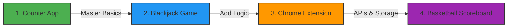
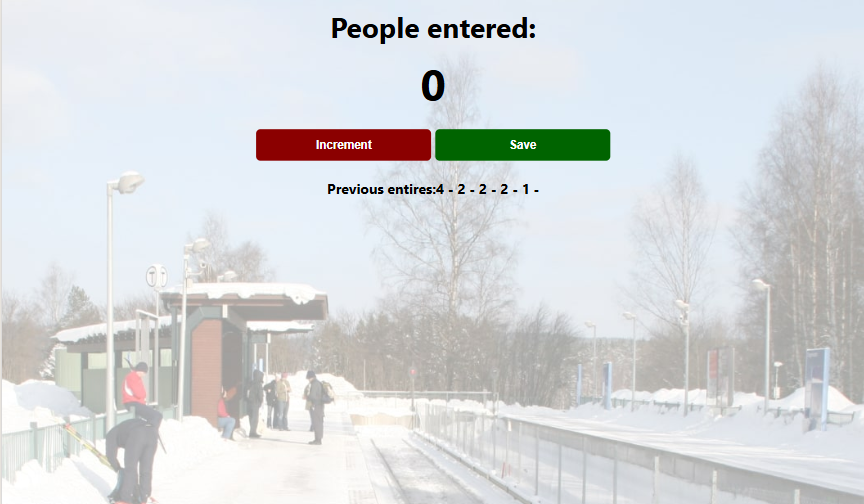

<div align="center">

# 🚀 JavaScript Fundamentals Projects

### *Master JavaScript through hands-on, real-world mini-projects*

[](https://developer.mozilla.org/en-US/docs/Web/JavaScript)
[](https://developer.mozilla.org/en-US/docs/Web/HTML)
[](https://developer.mozilla.org/en-US/docs/Web/CSS)

---

### 📋 Quick Navigation

**[📂 Projects](#-projects)** • **[🎓 Learning Path](#-learning-path)** • **[🚀 Installation](#-installation)** • **[🛠️ Tech Stack](#️-tech-stack)** • **[📸 Screenshots](#-screenshots)**

---

</div>

## 📂 Projects

### 1️⃣ Counter App
> **🎯 Difficulty:** Beginner  
> **⏱️ Time:** 30-45 minutes  
> **🎨 Preview:** [Screenshot](#counter-app-1)

**Track people entering a station with increment and save functionality**

A simple yet powerful introduction to JavaScript fundamentals. Build an interactive counter that stores entry counts.

#### 💡 Key Concepts

- Variables & Data Types
- Functions & Scope
- Arithmetic Operators
- String Concatenation
- DOM Manipulation
- Event Listeners
- Dynamic Content Updates
- Data Storage Basics

#### 📁 Project Structure
```
counter-app/
├── images/
│   └── station.png
├── counter-app.css
├── counter-app.html
└── counter-app.js
```

---

### 2️⃣ Blackjack Game
> **🎯 Difficulty:** Intermediate  
> **⏱️ Time:** 2-3 hours  
> **🎨 Preview:** [Screenshot](#blackjack-game-1)

**Classic card game with dealer logic and win/loss detection**

Build a fully functional Blackjack game with realistic game logic, state management, and dynamic UI updates.

#### 💡 Key Concepts

- Objects & Arrays
- Array Methods (push, pop, shift)
- Math.random() & Math.floor()
- Complex Data Manipulation
- Conditional Statements (if/else)
- Loops (for/while)
- Logical Operators (&&, ||)
- Boolean Logic
- Game State Management

#### 📁 Project Structure
```
Blackjack-game/
├── image/
│   └── table.png
├── blackjack.css
├── blackjack.html
└── blackjack.js
```

---

### 3️⃣ Chrome Extension
> **🎯 Difficulty:** Intermediate-Advanced  
> **⏱️ Time:** 3-4 hours  
> **🎨 Preview:** [Screenshot](#chrome-extension-1)

**Save and manage your favorite links with persistent storage**

Create a real Chrome extension that saves URLs, demonstrating modern web APIs and browser integration.

#### 💡 Key Concepts

- let & const Best Practices
- addEventListener Methods
- Template Literals (`${var}`)
- String/Number Conversion
- Objects in Arrays
- LocalStorage API
- Chrome Extension APIs
- JSON.stringify/parse
- Manifest Configuration
- Data Persistence

#### 📁 Project Structure
```
chrome-extension/
├── icon.png
├── index.html
├── index.css
├── index.js
└── manifest.json
```

#### 🔧 Chrome Extension Installation
```
1. Open Chrome and navigate to chrome://extensions/
2. Enable "Developer mode" (toggle in top-right corner)
3. Click "Load unpacked"
4. Select the chrome-extension folder from your project
5. The extension icon will appear in your toolbar!
```

---

### 4️⃣ Basketball Scoreboard
> **🎯 Difficulty:** Intermediate  
> **⏱️ Time:** 1-2 hours  
> **🎨 Preview:** [Screenshot](#basketball-scoreboard-1)

**Interactive scoreboard with real-time score tracking for home and guest teams**

Build a dynamic sports scoreboard that combines all previous concepts with advanced state management.

#### 💡 Key Concepts

- Multiple Function Calls
- Parameter Passing
- Reusable Functions
- DRY Principles
- Code Organization
- State Management
- Dynamic DOM Updates
- CSS Class Manipulation
- Real-time Updates
- Interactive Controls

#### 📁 Project Structure
```
basketball-scoreboard/
├── index.html
├── index.css
└── index.js
```

---

## 🎓 Learning Path

<div align="center">



</div>

### 📊 Skill Progression Matrix

| Project | Variables | Functions | Arrays | Objects | APIs | DOM | Events |
|---------|:---------:|:---------:|:------:|:-------:|:----:|:---:|:------:|
| Counter App | ✅ | ✅ | ❌ | ❌ | ❌ | ✅ | ✅ |
| Blackjack | ✅ | ✅ | ✅ | ✅ | ❌ | ✅ | ✅ |
| Chrome Extension | ✅ | ✅ | ✅ | ✅ | ✅ | ✅ | ✅ |
| Basketball Scoreboard | ✅ | ✅ | ✅ | ✅ | ❌ | ✅ | ✅ |

### 🎯 Recommended Learning Sequence

1. **Counter App** → Build foundational skills in variables, functions, and DOM manipulation
2. **Blackjack Game** → Add complexity with data structures and game logic
3. **Chrome Extension** → Learn browser APIs and data persistence
4. **Basketball Scoreboard** → Combine all skills into a polished application

---

## 🚀 Installation

1. **Clone the repository**
```bash
git clone https://github.com/shekhawatmuskan/javascript-projects.git
cd javascript-projects
```

2. **Choose a project to start**
```bash
cd counter-app
```

3. **Open in your browser**

**Option 1:** Double-click `index.html` or the project HTML file

**Option 2:** Use Live Server extension in VS Code
- Right-click on HTML file → "Open with Live Server"

**Option 3:** Use command line
```bash
# macOS
open counter-app.html

# Windows
start counter-app.html

# Linux
xdg-open counter-app.html
```

---

## 🛠️ Tech Stack

<div align="center">

| Technology | Purpose | Proficiency Level |
|------------|---------|-------------------|
|  | Semantic Structure & Layout | ⭐⭐⭐ |
|  | Styling, Flexbox, Grid, Animations | ⭐⭐⭐ |
|  | Logic, Interactivity & DOM Manipulation (ES6+) | ⭐⭐⭐⭐ |

</div>

### ✨ Key Features

<table>
<tr>
<td width="50%">

**Development Approach**
- ✨ Vanilla JavaScript - No frameworks
- 🎯 Pure fundamentals focus
- 📝 Clean, commented code
- 🏗️ Organized project structure

</td>
<td width="50%">

**Design & Functionality**
- 🎨 Modern CSS with Flexbox & Grid
- 📱 Responsive design principles
- 🔧 Browser APIs integration
- ⚡ Interactive & dynamic UIs

</td>
</tr>
</table>

---

## 📸 Screenshots

### <a id="counter-app-1"></a>Counter App


*Simple and intuitive interface for tracking people entering a station*

---

### <a id="blackjack-game-1"></a>Blackjack Game


*Interactive card game with realistic game mechanics*

---

### <a id="chrome-extension-1"></a>Chrome Extension


*Practical browser extension for managing your favorite links*

---

### <a id="basketball-scoreboard-1"></a>Basketball Scoreboard


*Dynamic scoreboard with real-time updates*

---


⭐ **Star this repo** if you found it helpful!

**[⬆ Back to Top](#-javascript-fundamentals-projects)**

</div>